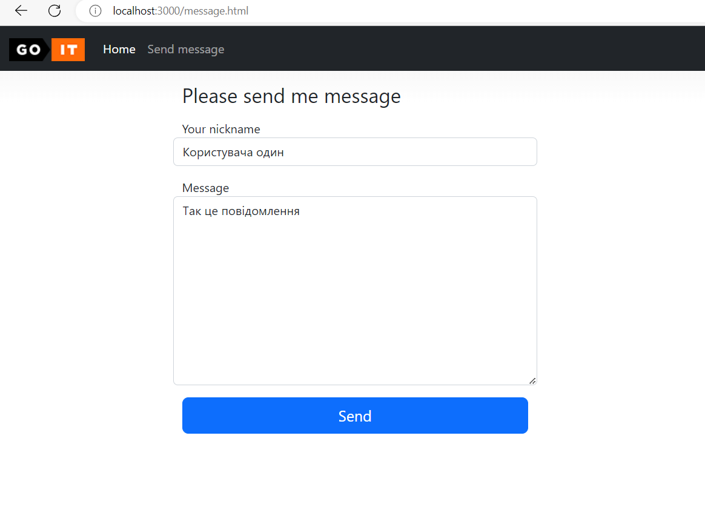
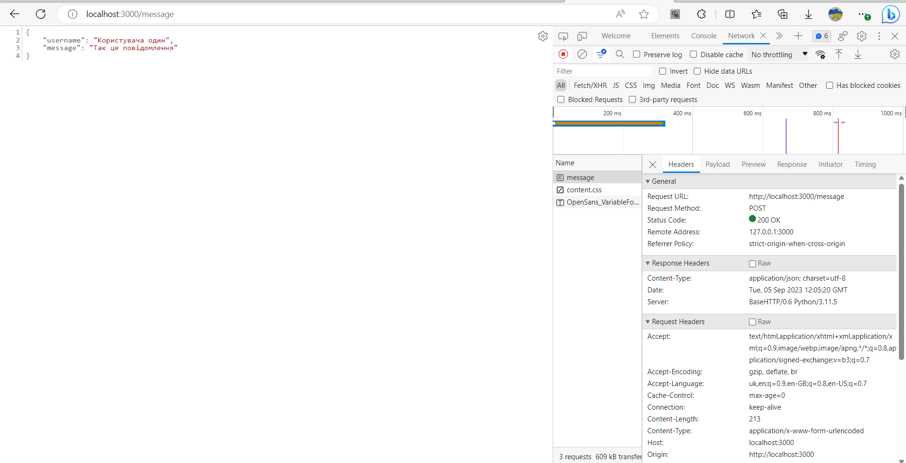

# goit_python_web_hw_04

## RUN WEB SERVER

```
 python  webapp/app.py
```

## INDEX


## MESSAGE

### MESSAGE FORM



 
### MESSAGE POST




## SOCKET SAVE STORAGE JSON 

### RUN SREVERS in Threads with WATHCDOG timer
WATHCDOG

```
  logger.info("run  WATHCDOG timer for servers in threads")
    while True:
        for name, th in threads.items():
            if not th.is_alive():
                logger.error(f"thread crashed, restart - {th.name}")
                th = servers_boot[name](name)
                threads[name] = th
        time.sleep(2)
```

### LOG
```
python main.py
2023-09-06 03:12:05,142 [ MainThread ] run_threads
2023-09-06 03:12:05,145 [ MainThread ] run  WATHCDOG timer for servers in threads
2023-09-06 03:12:05,145 [ SOCKET_SERVER ] Start Socket server
2023-09-06 03:12:06,180 [ HTTP_SERVER ] Start HTTP server at port: 3000
127.0.0.1 - - [06/Sep/2023 03:12:18] "GET / HTTP/1.1" 200 -
127.0.0.1 - - [06/Sep/2023 03:12:18] "GET /style.css HTTP/1.1" 200 -
127.0.0.1 - - [06/Sep/2023 03:12:18] "GET /logo.png HTTP/1.1" 200 -
127.0.0.1 - - [06/Sep/2023 03:12:25] "GET /message.html HTTP/1.1" 200 -
127.0.0.1 - - [06/Sep/2023 03:12:26] "GET /style.css HTTP/1.1" 200 -
127.0.0.1 - - [06/Sep/2023 03:12:26] "GET /logo.png HTTP/1.1" 200 -
127.0.0.1 - - [06/Sep/2023 03:12:59] "POST /message HTTP/1.1" 200 -
2023-09-06 03:12:59,811 [ HTTP_SERVER ] {"2023-09-06 03:12:59.809891": {"username": "Тестовий користувач", "message": "Повідомлення 1"}}
2023-09-06 03:12:59,817 [ SOCKET_SERVER ] Received data: {'2023-09-06 03:12:59.809891': {'username': 'Тестовий користувач', 'message': 'Повідомлення 1'}} from: ('127.0.0.1', 64030)
2023-09-06 03:12:59,819 [ SOCKET_SERVER ] Send data: {"STATUS": "OK"} to: ('127.0.0.1', 64030)
2023-09-06 03:12:59,820 [ HTTP_SERVER ] SAVED OK
127.0.0.1 - - [06/Sep/2023 03:13:14] "POST /message HTTP/1.1" 200 -
2023-09-06 03:13:14,654 [ HTTP_SERVER ] {"2023-09-06 03:13:14.653878": {"username": "Тестовий користувач", "message": "Повідомлення 2"}}
2023-09-06 03:13:14,670 [ SOCKET_SERVER ] Received data: {'2023-09-06 03:13:14.653878': {'username': 'Тестовий користувач', 'message': 'Повідомлення 2'}} from: ('127.0.0.1', 51094)
2023-09-06 03:13:14,671 [ SOCKET_SERVER ] Send data: {"STATUS": "OK"} to: ('127.0.0.1', 51094)
2023-09-06 03:13:14,671 [ HTTP_SERVER ] SAVED OK
127.0.0.1 - - [06/Sep/2023 03:13:20] "POST /message HTTP/1.1" 200 -
2023-09-06 03:13:20,618 [ HTTP_SERVER ] {"2023-09-06 03:13:20.614063": {"username": "Тестовий користувач", "message": "Повідомлення 3"}}
2023-09-06 03:13:20,638 [ SOCKET_SERVER ] Received data: {'2023-09-06 03:13:20.614063': {'username': 'Тестовий користувач', 'message': 'Повідомлення 3'}} from: ('127.0.0.1', 64437)
2023-09-06 03:13:20,642 [ HTTP_SERVER ] SAVED OK
2023-09-06 03:13:20,648 [ SOCKET_SERVER ] Send data: {"STATUS": "OK"} to: ('127.0.0.1', 64437)
```


## DOCKER

## dockerfile

```
FROM python:3.11-slim
ENV APP_HOME /app 
WORKDIR $APP_HOME
COPY . .
EXPOSE 3000/tcp
VOLUME $APP_HOME/storage
ENTRYPOINT [ "python", "main.py" ]
```

### BUILD
```
docker build . -t lexxai/web_hw_04
```

### RUN
```
docker run -it -d --rm -p 3000:3000  -v web_hw_04_volume:/app/storage  --name web_hw_04  lexxai/web_hw_04 
```    


